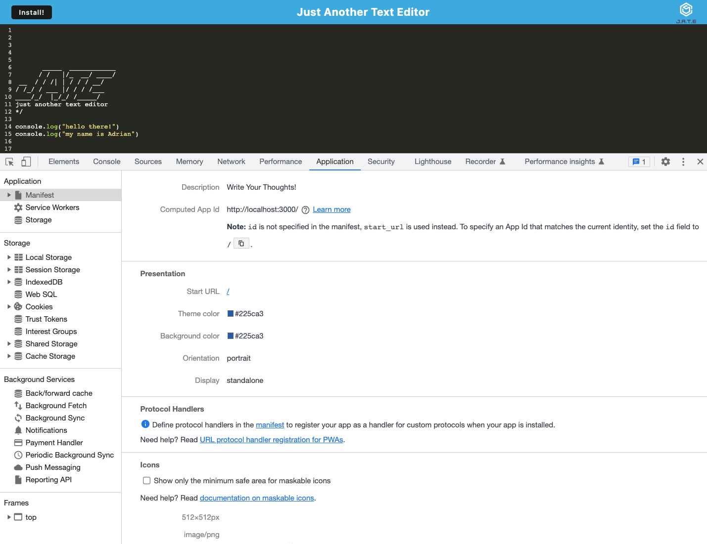
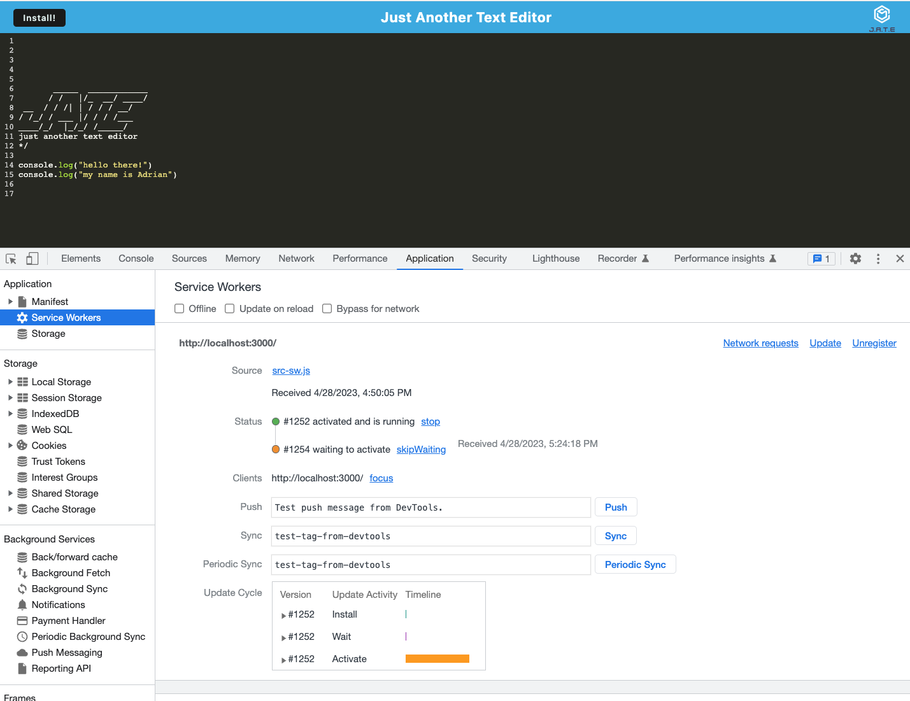
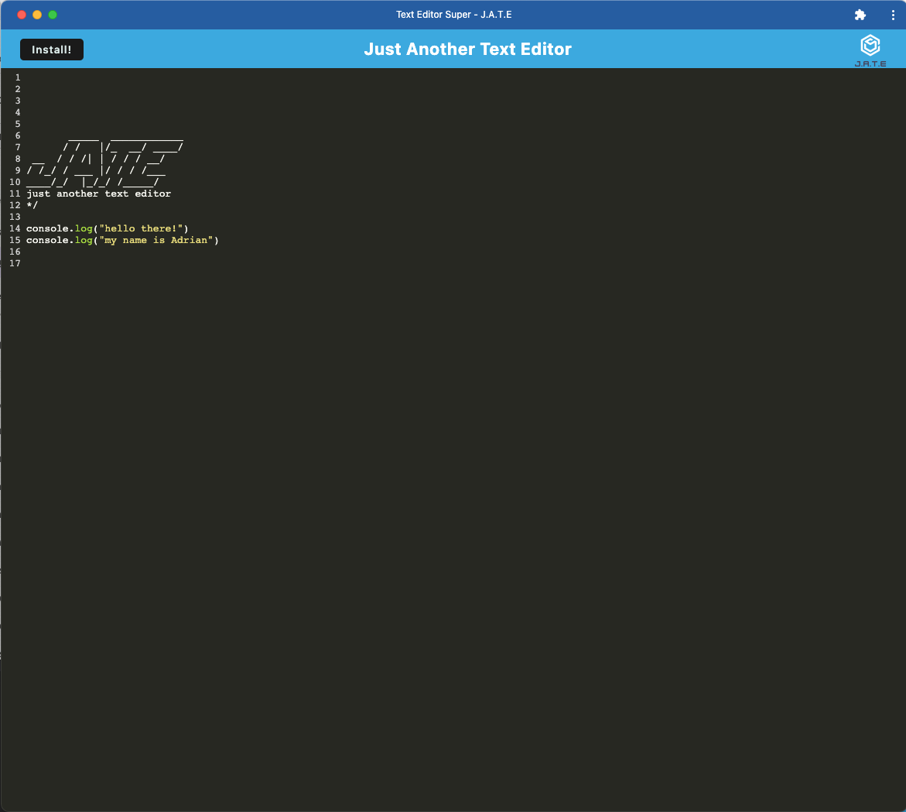

    

 

    
    
    
    

## Table of Contents

- [Overview](#overview)
- [Built With](#built-with)
- [Live Preview](#Live-Preview)
- [Contact](#contact)

## Overview

AS A developer
I WANT to create notes or code snippets with or without an internet connection
SO THAT I can reliably retrieve them for later use.
Scrivo can also be downloaded and used as a native application.
 

***Jest indexedDb***

      

 

***Jest Manifest***

      

 

***Jest service worker***

      

### Built With

 

    [JavaScript](https://devdocs.io/javascript/)

 JS-BLACK-logo.png"  width="25" height="20">   [nodeJS](https://nodejs.org/en/docs/)

     [indexedDB](https://developer.mozilla.org/en-US/docs/Web/API/IndexedDB_API/Using_IndexedDB)

    [NPM](https://www.npmjs.com/)

## Live Preview

      

[Click Here For Live Scrivo](https://scrivo.herokuapp.com)

## Contact

If you would like to contribute or have any questions , please contact us through <u>**GitHub**</u>:

 [GitHub](https://github.com/moraadrian510)

 [Email](mailto:moraadrian510@icloud.com)

**Thank You for your feedback!!**

---